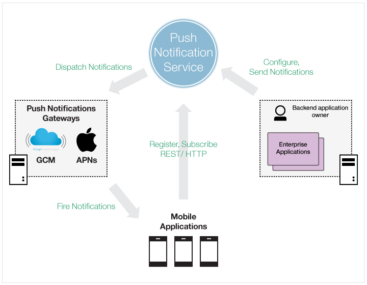

---

copyright:
 years: 2015, 2016

---

# 푸시 알림에 대한 정보
{: #overview-push}

푸시 알림은 iOS 및 Android 디바이스에 알림을 보내는 데 사용할 수 있는 서비스입니다. 알림은 모든 애플리케이션 사용자와 태그를 사용하는 특정 디바이스 및 사용자 세트를 대상으로 할 수 있습니다. 디바이스, 태그 및 구독을 관리할 수 있습니다. 또한 SDK(software development kit) 및 REST(Representational State Transfer) API(application program interface)를 사용하여 클라이언트 애플리케이션을 추가적으로 개발할 수도 있습니다.   

## 푸시 알림 서비스 프로세스
{: #overview_push_process}

모바일 클라이언트는 푸시 알림 서비스에 등록하고 구독을 신청할 수 있습니다. 시작 시 모바일 애플리케이션이 푸시 알림 서비스에 등록하고 구독을 신청합니다. 알림은 APNs(Apple Push Notification Service) 또는 GCM(Google Cloud Messaging)으로 디스패치된 후 등록된 모바일 클라이언트로 전송됩니다.

**모바일 애플리케이션**

시작 시 모바일 애플리케이션이 알림을 받기 위해 푸시 알림 서비스에 등록하고 구독을 신청합니다. 

**백엔드 애플리케이션**

백엔드 애플리케이션은 사내 또는 퍼블릭 클라우드에 있을 수 있습니다. 백엔드 애플리케이션은 푸시 알림 서비스를 사용하여 상황에 맞는 알림을 모바일 사용자에게 전송합니다. 푸시 알림 전송을 위해 백엔드 애플리케이션이 모바일 디바이스 및 사용자 정보를 유지보수하고 관리할 필요는 없습니다. 대신 백엔드 애플리케이션은 푸시 알림 서비스를 사용할 수 있습니다. 

**앱 백엔드 소유자**

푸시 알림 서비스의 인스턴스를 번들로 묶는 모바일 백엔드 애플리케이션을 작성한 역할입니다. 이 사용자가 푸시 알림 서비스를 사용하는 백엔드 애플리케이션과 푸시 알림의 대상인 모바일 애플리케이션에 맞게 푸시 알림 서비스를 구성하고 설정합니다. 

**Push Notification Service**

푸시 알림 서비스는 알림을 위해 등록되는 디바이스와 관련된 모든 정보를 관리합니다. 이 서비스가 이기종 모바일 플랫폼에 알림을 전송하는 기술 세부사항을 애플리케이션에 적용할 수 있도록 알려주고 이 모든 것을 내부에서 처리합니다. 

**게이트웨이**

모바일 디바이스 플랫폼 관련 클라우드 서비스(예: GCM(Google Cloud Messaging) 또는 APNs(Apple Push Notification Service)는 푸시 알림 서비스를 사용하여 모바일 애플리케이션에 알림을 디스패치합니다. 

## 푸시 알림 유형
{: #overview-push-types}

**브로드캐스트**

모바일 애플리케이션이 자체적으로 푸시 알림 서비스에 등록하면 브로드캐스트 수신을 시작할 수 있습니다. 브로드캐스트 알림은 푸시 알림 서비스를 위한 애플리케이션이 설치 및 구성되어 있는 모든 디바이스를 대상으로 하는 알림 메시지입니다. 푸시 알림이 사용 가능하게 설정된 애플리케이션을 사용할 경우 브로드캐스트 알림이 기본적으로 사용됩니다. 푸시 알림 서비스가 사용 가능하게 설정된 애플리케이션에는 Push.ALL 태그에 대한 구독이 사전 정의되어 있고, 서버에서는 이 태그를 사용하여 모든 디바이스에 알림 메시지를 브로드캐스트합니다. REST Push API를 사용하는 브로드캐스트 알림을 전송하려면 메시지 자원에 게시할 때 "대상"은 빈 JSON 파일이어야 합니다. 

**태그 기반 알림**

태그 알림은 특정 태그에 구독된 모든 디바이스를 대상으로 하는 알림 메시지입니다. 태그 기반 알림을 사용하면 제목 영역 또는 주제를 기반으로 알림을 구분할 수 있습니다. 알림 수신인은 관심있는 제목 또는 주제에 대한 알림일 경우에만 알림을 수신하도록 선택할 수 있습니다. 따라서 태그 기반 알림은 수신인을 구분할 수 있는 수단을 제공합니다. 이 기능을 사용하면 태그를 정의한 다음 태그별로 메시지를 전송 및 수신할 수 있는 기능을 사용할 수 있습니다. 메시지는 태그에 구독된 디바이스만 대상으로 합니다. 먼저 애플리케이션에 대한 태그를 작성하고, 태그 구독을 설정한 다음, 태그 기반 알림을 시작해야 합니다. REST API를 사용하는 태그 기반 알림을 전송하려면 메시지 자원에 게시할 때 "tagNames"가 제공되는지 확인하십시오. 

**유니캐스트 알림**

유니캐스트 알림은 특정 디바이스를 대상으로 하는 알림 메시지입니다. 유니캐스트 알림에는 추가 설정이 필요하지 않으며 애플리케이션에서 푸시 알림을 사용하는 경우 기본적으로 사용 설정됩니다. REST API를 사용하는 유니캐스트 알림을 전송하려면 메시지 자원에 게시할 때 deviceId가 제공되는지 확인하십시오. 

**플랫폼 기반 알림**

특정 디바이스 플랫폼에 도달하도록 알림의 대상을 설정할 수 있습니다. 예를 들어, 모든 Android 사용자에게만 알림을 전송할 수 있습니다. REST API를 사용하는 플랫폼 기반 알림을 전송하려면 메시지 자원에 게시할 때 대상 플랫폼이 제공되는지 확인하십시오. 플랫폼을 어레이로 지정하십시오. 지원되는 플랫폼은 다음과 같습니다. 
* A(Apple)
* G(Google)
