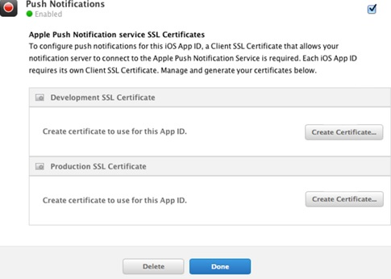
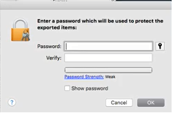
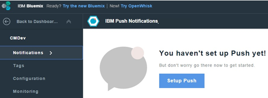
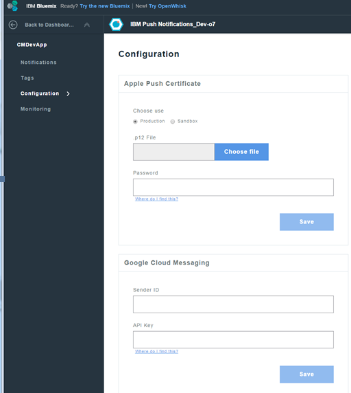

---

copyright:
 years: 2015, 2016

---

{:new_window: target="_blank"}
# Apple 푸시 알림(APN)에 대한 신임 정보 구성

{: #create-push-credentials-apns}

애플리케이션 개발자는 APNs(Apple Push Notification service)를 이용하여 Bluemix의 푸시 서비스 인스턴스(제공자)에서 iOS 디바이스와 애플리케이션으로 원격 알림을 전송할 수 있습니다. 디바이스의 대상 애플리케이션으로 메시지가 전송됩니다. APNs 신임 정보를 획득하여 구성합니다. APNs 인증서는 푸시 알림 서비스에서 안전하게 관리하며 제공자 자격으로 APNs 서버에 연결할 때 사용합니다. 

1. [Apple 개발자](https://developer.apple.com/) 계정을 확보하십시오. 
2. [앱 ID를 등록하십시오.](#create-push-credentials-apns-register)
3. [개발 및 배포 APNs SSL 인증서 작성](#create-push-credentials-apns-ssl)
4. [개발 프로비저닝 프로파일을 작성하십시오.](#create-push-credentials-dev-profile)
5. [저장소 배포 프로비저닝 프로파일을 작성하십시오.](#create-push-credentials-apns-distribute_profile)
6. [푸시 대시보드에서 APNs를 설정하십시오.](#create-push-credentials-apns-dashboard)

##앱 ID 등록
{: #create-push-credentials-apns-register}

앱 ID(번들 ID)는 특정 애플리케이션을 식별하는 고유 ID입니다. 각 애플리케이션에 앱 ID가 필요합니다. 푸시 알림 서비스와 같은 서비스가 앱 ID에 따라 구성됩니다. 

1. [Apple 개발자](https://developer.apple.com) 포털로 이동하여 **멤버 센터**를 클릭하고 **인증서, ID 및 프로파일**을 선택하십시오.
2. [Apple 개발자 라이브러리](https://developer.apple.com/library/mac/documentation/IDEs/Conceptual/AppDistributionGuide/MaintainingProfiles/MaintainingProfiles.html#//apple_ref/doc/uid/TP40012582-CH30-SW991)의 **앱 ID 등록** 섹션으로 이동하여 지시사항을 따라 앱 ID를 등록하십시오. 

	**참고**: 앱 ID를 등록할 때 다음 옵션을 선택하십시오.
	* 푸시 알림

	

	* 명시적 ID 접미부

	
3. 다음 단계. 개발 및 배포 APNs SSL 인증서를 작성하십시오. 

##개발 및 배포 APNs SSL 인증서 작성
{: #create-push-credentials-apns-ssl}

APNs 인증서를 획득하려면 먼저 인증서 서명 요청(CSR)을 작성하여 이를 Apple 인증 기관(CA)에 제출해야 합니다. CSR에는 사용자의 회사, Apple 푸시 알림에 서명할 때 사용하는 공용 및 개인 키를 식별하는 정보가 포함됩니다. 그런 다음 iOS 개발자 포털에서 SSL 인증서를 생성하십시오. 인증서와 이의 공용 및 개인 키는 Keychain Access에 저장됩니다. 

**시작하기 전에**

[앱 ID를 등록하십시오.](#create-push-credentials-apns-register)

APNs는 샌드박스 모드와 프로덕션 모드에서 사용할 수 있습니다. 

* 샌드박스 모드는 개발 및 테스트 중에 사용됩니다. 
* 프로덕션 모드는 앱 저장소(또는 다른 엔터프라이즈 배포 메커니즘)를 통해 애플리케이션을 배포할 때 사용됩니다. 

개발 및 배포 환경을 위한 별도의 인증서를 획득해야 합니다. 인증서는 원격 알림의 수신인인 앱의 앱 ID와 연관되어 있습니다. 프로덕션의 경우 최대 2개의 인증서를 작성할 수 있습니다. Bluemix는 인증서를 사용하여 APNs와의 SSL 연결을 설정합니다. 

개발 및 배포 SSL 인증서를 작성하십시오. 

1. [Apple 개발자](https://developer.apple.com)로 이동하여 **멤버 센터**를 클릭하고 **인증서, ID 및 프로파일**을 선택하십시오.
2. **ID** 영역에서 **앱 ID**를 클릭하십시오. 
3. 앱 ID 목록에서 새로 작성한 앱 ID를 선택한 다음 **설정**을 선택하십시오. 
4. **푸시 알림** 영역에서 개발 SSL 인증서를 작성한 다음 프로덕션 SSL 인증서를 작성하십시오.

	인증서 서명 요청 작성 정보 화면이 표시됩니다.

	

5. Mac의 경우**Keychain Access** 애플리케이션을 시작하여 인증서 서명 요청(CSR)을 작성하십시오. 
6. **Keychain Access > 인증서 지원 > 인증 기관에 인증서 요청…** 를 선택하십시오. 
7. **인증서 정보**에서 앱 개발자 계정과 연관된 이메일 주소와 공통 이름을 입력하십시오. 개발(샌드박스)용 인증서인지 배포(프로덕션)용 인증서인지 식별할 수 있도록 의미있는 이름을 지정하십시오. 예를 들어, **sandbox_apns_certificate** 또는 **production_apns_certificate**가 있습니다.

8. **디스크에 저장**을 선택하여 **.certSigningRequest** 파일을 데스크탑에 다운로드한 다음 **계속**을 클릭하십시오. 
9. **다른 이름으로 저장**에서 **.certSigningRequest** 파일의 이름(예: **sandbox.certSigningRequest**)을 지정한 다음 **저장**을 클릭하십시오. 
10. **완료**를 클릭하십시오. 이제 CSR이 작성되었습니다. 
11. **인증서 서명 요청(CSR) 작성 정보**에서 **계속**을 클릭하십시오. 12. 
12. **생성** 화면에서 **파일 선택... **을 클릭하고 데스크탑에 저장한 CSR 파일을 선택하십시오. 그런 다음 **생성**을 클릭하십시오. 

	

13. 인증서가 준비되면 **완료**를 클릭하십시오. 
14. **푸시 알림** 화면에서 **다운로드**를 클릭하여 인증서를 다운로드하고 **완료**를 클릭하십시오. 
15. Mac의 경우 **Keychain Access > 내 인증서**로 이동하여 새로 설치된 인증서를 찾아보십시오. 인증서를 두 번 클릭하여 Keychain Access에 인증서를 설치하십시오. 
16. 인증서와 개인 키를 선택한 다음 **내보내기** 를 선택하여 인증서를 개인 정보 변환 형식(.p12 형식)으로 변환하십시오.

	

17. **다른 이름으로 저장**에서 나중에 식별할 수 있도록 인증서에 의미있는 이름(예: **sandbox_apns.p12_certifcate** 또는 **production_apns.p12**)을 지정한 다음 **저장**을 클릭하십시오. 

   	

18. **비밀번호 입력** 화면에서 내보낸 항목을 보호하기 위한 비밀번호를 입력하고 **확인**을 클릭하십시오. 나중에 이 비밀번호를 사용하여 푸시 대시보드에서 APNs 설정을 구성하게 됩니다. 

	
19. 키체인의 키를 내보내려는 **Key Access.app** 화면에서, 시스템이 이들 항목을 내보낼 수 있도록 Mac의 관리 비밀번호를 입력한 다음 **항상 허용**을 선택하십시오. 데스크탑에 .p12 인증서가 생성됩니다. 
20. 다음 단계[개발 및 배포 프로비저닝 프로파일 작성](#create-push-credentials-dev-profile)파일

##개발 프로비저닝 프로파일 작성
{: #create-push-credentials-dev-profile}

프로비저닝 프로파일은 APP ID와 함께 작동하여 사용자 앱을 설치하고 실행할 수 있는 디바이스 및 사용자 앱에서 액세스할 수 있는 서비스를 판별합니다. 각 앱 ID에 대해 개발 및 배포용으로 두 개의 프로비저닝 프로파일을 작성하십시오. Xcode는 개발 프로비저닝 프로파일을 사용하여 애플리케이션을 빌드할 수 있는 개발자와 애플리케이션을 테스트할 수 있는 디바이스를 판별합니다.

**시작하기 전에**

앱 ID를 등록하고 이를 푸시 알림 서비스에 사용할 수 있도록 설정하였으며
개발 및 프로덕션 APNs SSL 인증서를 사용하도록 구성했는지 확인하십시오.

개발 프로비저닝 프로파일을 작성하십시오. 

1. [Apple 개발자](https://developer.apple.com) 포털로 이동하여 **멤버 센터**를 클릭하고 **인증서, ID 및 프로파일**을 선택하십시오.
2. [Mac 개발자 라이브러리](https://developer.apple.com/library/mac/documentation/IDEs/Conceptual/AppDistributionGuide/MaintainingProfiles/MaintainingProfiles.html#//apple_ref/doc/uid/TP40012582-CH30-SW62site)로 이동하여 **개발 프로비저닝 프로파일 작성**으로 스크롤한 다음 지시에 따라 개발 프로파일을 작성하십시오. 

	**참고**:개발 프로비저닝 프로파일을 구성할 때 다음 옵션을 선택하십시오. 
	* **iOS 앱 개발**
	* **iOS 및 watchOS 앱용**
3. 다음 단계. [저장소 배포 프로비저닝 프로파일을 작성하십시오.](#create-push-credentials-apns-distribute_profile)

##저장소 배포 프로비저닝 프로파일 작성
{: #create-push-credentials-apns-distribute_profile}

저장소 프로비저닝 프로파일을 사용하여 배포용 앱을 앱 저장소에 제출하십시오. 

1. [Apple 개발자](https://developer.apple.com) 포털로 이동하여 **멤버 센터**를 클릭하고 **인증서, ID 및 프로파일**을 선택하십시오.
2. 다운로드한 프로비저닝 프로파일을 두 번 클릭하여 이를 Xcode에 설치하십시오. 
3. 다음 단계. [푸시 대시보드에서 APNS를 설정하십시오.](#create-push-credentials-apns-dashboard)

##푸시 알림 대시보드에서 APNs 설정
{: #create-push-credentials-apns-dashboard}

푸시 알림 서비스를 사용하여 알림을 전송하려면 APNs(Apple Push Notification service)에 필요한 SSL 인증서를 업로드하십시오. 또한 REST API를 사용하여 APNs 인증서를 업로드할 수 있습니다. 

**시작하기 전에**

개발 및 프로덕션 APNS SSL 인증서와, 각 인증서 유형과 연관된 비밀번호를 확인해두십시오. 자세한 정보는 APNS를 위한 푸시 알림 작성 및 구성을 참조하십시오. 

APNs에 필요한 인증서는 .p12 인증서이며 이 인증서에는 애플리케이션을 빌드하고 공개하는 데 필요한 SSL 인증서와 개인 키가 포함되어 있습니다. Apple Developer 웹 사이트의 Member Center에서 인증서를 생성해야 합니다(유효한 Apple Developer 계정 필요). 개발 환경(샌드박스)과 프로덕션(배포) 환경에 대해 별도의 인증서가 필요합니다.

**참고**: **cer**이 키 체인 액세스에 있으면 이를 컴퓨터로 내보내서 .p12 인증서를 작성하십시오. 

APNs 사용에 대한 자세한 정보는 [iOS Developer Library: Local and Push Notification Programming Guide](https://developer.apple.com/library/ios/documentation/NetworkingInternet/Conceptual/RemoteNotificationsPG/Chapters/ProvisioningDevelopment.html#//apple_ref/doc/uid/TP40008194-CH104-SW4)를 참조하십시오. 

푸시 대시보드에서 APNs를 설정하십시오. 

1. Bluemix 대시보드에서 백엔드 애플리케이션을 열고 **IBM 푸시 알림** 서비스를 클릭하여 푸시 대시보드를 여십시오.

	

	푸시 대시보드가 표시됩니다. 
	
	
1
2. **구성** 탭에서 **Apple 푸시 인증서** 섹션으로 이동하여 **샌드박스**(개발) 또는 **프로덕션**(분배)를 선택하고 p.12 인증서를 Bluemix에 업로드하십시오. 

	
3. **Password** 필드에서 **.p12** 인증서 파일과 연관된 비밀번호를 입력하고 **저장**을 클릭하십시오.
올바른 비밀번호를 사용하여 인증서를 업로드한 후 알림 전송을 시작할 수 있습니다. 
1. 다음 단계. [iOS에서 알림을 사용하도록 설정하십시오](c_ios_enable.html).
